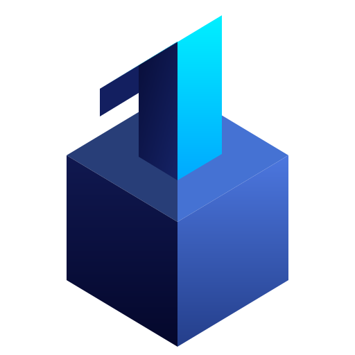

<div align="center">
  
  <h1>OneBase AI</h1>
  <p><strong>像配置静态网站一样，一键构建与部署 AI 动态服务 (RAG 底座)</strong></p>
</div>

## 🌟 项目简介

OneBase 是一个开箱即用的现代化 RAG（检索增强生成）框架脚手架。它将复杂的向量数据库配置、文件解析、大模型调度以及前端 UI 渲染封装在极简的命令之中。无论你是想快速搭建一个专属的个人知识库助手，还是想为企业部署一套基于私有数据的问答系统，OneBase 都能让你在几分钟内完成从“0”到“上线”的全过程。

**核心理念：约定大于配置 (Convention over Configuration)**

你只需要把 Markdown 或 PDF 文件丢进 `base/` 目录，OneBase 就会自动为你生成可视化的知识树，并完成向量化检索。

## ✨ 核心特性

- 🛠️ **一键初始化与构建**：一条命令生成配置，自动扫描文档并切片入库。
- 🧠 **主流大模型全覆盖**：无缝对接 OpenAI, Claude, DeepSeek, Gemini, 以及智谱、通义千问等国内外主流 LLM。
- 📚 **强大的 RAG 检索**：基于 langchain 和 pgvector，提供高精度的语义搜索。
- 💬 **多轮对话与持久化记忆**：内置 PostgreSQL 会话记录，刷新页面也不丢失对话上下文。
- 📄 **可视化文件预览**：类似 VSCode 的左侧目录树，支持点击实时预览 Markdown 文件，并在聊天中高亮引用代码。
- 📎 **实时文档上传**：前端界面直接拖拽上传 PDF/TXT/MD，即刻学习，即刻提问。
- 🐳 **全栈容器化部署**：后端 FastAPI + 前端 Vue 3，自动生成 docker-compose.yml，一键部署到任何服务器。

## 🚀 快速上手

### 1. 安装 OneBase

确保你的系统已安装 Python 3.10+ 和 Docker Desktop。

```bash
# 全局安装 OneBase CLI
pip install onebase-ai

# (如果你是通过源码运行，请确保已安装 requirements.txt 中的依赖，并使用 python onebase/cli.py 代替 onebase 命令)
```

### 2. 初始化项目

在一个空目录中运行：

```bash
onebase init
```

这会生成默认的 `onebase.yml` 配置文件、`.env` 环境变量模板，一个空的requirements.txt，以及用于存放文档的 `base/` 目录。

### 3. 配置你的模型

编辑 `.env` 文件，填入你选择的大模型 API Key：

```env
OPENAI_API_KEY=your_api_key_here
OPENAI_BASE_URL=https://api.openai.com/v1 # 如果你的提供商是OpenAI
```

编辑 `onebase.yml`，选择你想用的模型引擎：

```yaml
engine:
  reasoning:
    provider: openai
    model: gpt-3.5-turbo
  embedding:
    provider: openai
    model: text-embedding-3-small
```

### 4. 放入知识库文档

将你的 `.md`, `.txt` 或 `.pdf` 文件放入 `base/` 目录中。OneBase 会自动扫描这个目录。

### 5. 安装依赖包
**安装所需的PyPi包：**，你可以在根目录执行
```bash
onebase get-deps # 这会在终端输出所需的依赖包名单
```
你可以手动安装这些依赖，或在requirements.txt中写入这些包名并指定版本号（可选），然后执行；`pip install -r requirements.txt`

### 6. 构建向量知识库

```bash
onebase build
```

这一步会启动 PostgreSQL (pgvector)，读取你的文档，进行切片 (Chunking)，并调用 Embedding API 将数据存入向量数据库。

### 7. 启动服务

```bash
onebase serve --port 8000
```

启动成功后，在浏览器中访问 `http://localhost:8000`，开始与你的专属 AI 知识库对话！

## 📂 目录结构规范

OneBase 极力推崇基于文件系统的约定路由。在 `onebase.yml` 中设置 `struct: default` 时，它会根据你的 `base/` 目录结构自动生成前端导航树。当然，你也可以手动在struct字段指定文件结构，系统会自动识别，主要：如果手动指定，会覆盖默认结构，未写入的文件会被无视。

例如，如果你写 `struct: default` ，且你的原目录结构为：
```
your-project/
├── base/                   # 你的知识文档都放在这里
│   ├── overview.md
│   ├── 开发指南/
│   │   ├── 快速入门.md
│   │   └── API接口.md
│   └── 产品文档/
│       ├── 设计规范.pdf
│       └── 常见问题.txt
├── .env                    # 敏感的 API 密钥配置
├── onebase.yml             # 项目的核心配置文件
└── .onebase/               # 自动生成的构建产物与 Docker 编排文件
```
则知识库文件的实际目录结构为：
```
overview.md
开发指南/
   ├── 快速入门.md
   └── API接口.md
产品文档/
   ├── 设计规范.pdf
   └── 常见问题.txt
```
若你的struct字段为：
```yaml
struct:
    - overview: overview.md
    - section1:
       - section1.1: <你的原路径>/section1-1.md
       - section1.2: <你的原路径>/section1-2.md
```
则无论原目录结构如何，知识库文件被渲染出的实际目录结构均为：
```
overview.md
section1/
    ├── section1.1.md
    └── section1.2.md
```

## 🤖 模型配置

OneBase AI支持大部分的的云端模型和部分本地模型（可能需要额外配置），详情参见[模型支持与配置](./docs/MODELS.md)

## 🛠️ 架构设计

- **CLI 引擎**: Typer + Rich
- **后端服务**: FastAPI + SQLAlchemy
- **AI / RAG 层**: LangChain + PGVector
- **前端应用**: Vue 3 + Tailwind CSS + Marked (带代码高亮)
- **部署方式**: Docker Compose

## 🛠️ API文档

## 🤝 参与贡献

欢迎提交 Issue 和 Pull Request！如果你有任何关于支持新模型、改进前端 UI 或优化 RAG 检索效果的想法，请随时发起讨论。

## 📄 许可证

本项目基于 MIT License 开源。